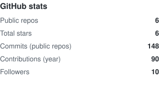
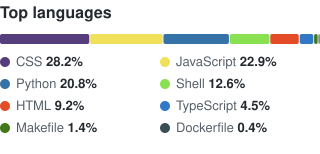

<h1 align="center">Igor Khaylov</h1>

  Backend Developer · Python / Django · Samarkand, Uzbekistan

  
  
  

---

I build backends for the web with **Python and Django** — from small business sites to
containerized, production-ready applications with a REST API, background tasks and CI/CD.

- 🔭 Currently maintaining my own [production Django starter](https://github.com/igorkhaylov/django-template)
  (Django 5.2 · DRF · PostgreSQL · Redis · Celery · MinIO · Docker · Nginx)
- 🧰 Day-to-day: REST APIs, PostgreSQL, Docker Compose deployments, i18n, Linux servers
- 🐧 Arch Linux + Sway user — my configs are [in the open](https://github.com/igorkhaylov/archlinux_config)
- 💬 Open to backend work and freelance projects — Telegram is the fastest way to reach me

### Tech stack

### Selected projects

| Project | What it is | Stack |
| --- | --- | --- |
| **[django-template](https://github.com/igorkhaylov/django-template)** | Production-oriented Django starter: fully containerized, structured logging, tests and CI/CD out of the box | Django 5.2, DRF, PostgreSQL, Redis, Celery, MinIO, Docker, uv, Ruff, pytest |
| **[portfolio](https://github.com/igorkhaylov/portfolio)** | This site — [igorkhaylov.uz](https://igorkhaylov.uz). Bilingual, every page rendered from the database and edited in the admin | Django, DRF, PostgreSQL, Celery, MinIO, Docker |
| **[react-template](https://github.com/igorkhaylov/react-template)** | Frontend starter to pair with the Django template | React, TypeScript, Vite |
| **[archlinux_config](https://github.com/igorkhaylov/archlinux_config)** · **[archlinux_sway](https://github.com/igorkhaylov/archlinux_sway)** | My Arch Linux dotfiles: i3 and Sway setups, plus the notes from building them | Shell, Arch Linux |

### GitHub

<!-- The cards are static SVGs regenerated weekly by .github/workflows/stats.yml —
     the shared github-readme-stats instance kept answering 503. -->

  <picture>
    <source media="(prefers-color-scheme: dark)" srcset="assets/stats-dark.svg">
    
  </picture>
  &nbsp;&nbsp;
  <picture>
    <source media="(prefers-color-scheme: dark)" srcset="assets/langs-dark.svg">
    
  </picture>

---

<b>🇷🇺 По-русски</b>

 

**Игорь Хайлов** — backend-разработчик, Python / Django. Самарканд, Узбекистан.

Пишу backend для веба на Python и Django: от сайтов под ключ до контейнеризованных
production-приложений с REST API, фоновыми задачами и CI/CD.

- 🔭 Развиваю собственный [production-шаблон Django](https://github.com/igorkhaylov/django-template)
  (Django 5.2 · DRF · PostgreSQL · Redis · Celery · MinIO · Docker · Nginx)
- 🧰 В работе: REST API, PostgreSQL, деплой через Docker Compose, мультиязычность, Linux-серверы
- 🐧 Пользуюсь Arch Linux + Sway, [конфиги в открытом доступе](https://github.com/igorkhaylov/archlinux_config)
- 💬 Открыт к backend-задачам и фриланс-проектам — быстрее всего писать в Telegram

**Опыт:** с 2020 года — фриланс-разработка на Django, доработка и поддержка сайтов,
веб-приложения для бизнеса; преподавал Python в IT-школе. Программирую с 2019 года.

  Сайт-портфолио: <a href="https://igorkhaylov.uz">igorkhaylov.uz</a> · исходники — <a href="https://github.com/igorkhaylov/portfolio">igorkhaylov/portfolio</a>

